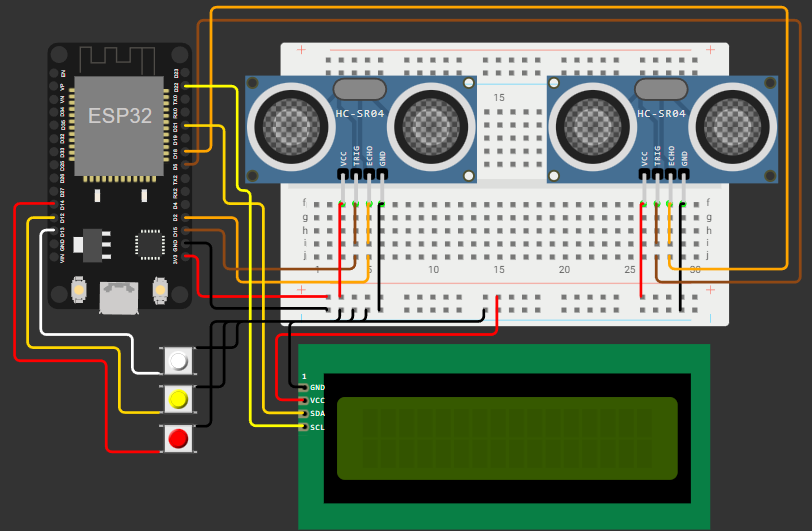

# 🐾 Challenger IoT — CLYVO VET

Sistema IoT inteligente para monitoramento alimentar e de hidratação de pets utilizando ESP32, sensores ultrassônicos, display LCD I2C, API REST em JSON e dashboard web embarcado no próprio ESP32.

---

# 📖 Sobre o Projeto

O **CLYVO VET** foi desenvolvido com o objetivo de auxiliar tutores e profissionais veterinários no acompanhamento do comportamento alimentar e da hidratação de animais domésticos.

O sistema monitora automaticamente quando o pet:
- se aproxima do recipiente de comida
- se aproxima do recipiente de água

Cada evento é registrado em tempo real, armazenando:
- quantidade de visitas
- horário exato do evento
- histórico diário
- tipo da interação

Além disso, os dados são disponibilizados através de:
- API REST em JSON
- dashboard web local
- integração Wi-Fi

---

# 🎯 Objetivo

O projeto busca transformar ações simples do cotidiano em dados relevantes para análise comportamental e prevenção de problemas de saúde.

Muitos tutores:
- não acompanham a rotina do pet
- não percebem alterações de comportamento rapidamente
- não possuem histórico de alimentação e hidratação

O CLYVO VET resolve isso automatizando todo o monitoramento.

---

# 💡 Funcionalidades

✅ Monitoramento de alimentação  
✅ Monitoramento de hidratação  
✅ Registro de horário via NTP  
✅ Histórico diário automático  
✅ Reset automático a cada novo dia  
✅ API REST em JSON  
✅ Dashboard web embarcado no ESP32  
✅ Display LCD em tempo real  
✅ Integração via Wi-Fi  
✅ Botões físicos para visualização dos dados no Serial Monitor  
✅ Sistema embarcado utilizando ESP32  

---

# 🧠 Funcionamento do Sistema

O sistema utiliza dois sensores ultrassônicos HC-SR04:

- um sensor monitora a área da comida
- outro sensor monitora a área da água

Quando o pet aproxima do recipiente:
1. o sensor detecta redução da distância
2. o ESP32 identifica a presença
3. o sistema registra o horário via NTP
4. os contadores do dia são atualizados
5. o LCD exibe o evento
6. os dados ficam disponíveis na API REST
7. o dashboard web é atualizado automaticamente

Quando o relógio atinge **00:00**, o sistema:
- cria automaticamente um novo dia
- reinicia os contadores diários
- mantém o histórico dos dias anteriores

---

# 🌐 Dashboard Web

O projeto possui um dashboard web hospedado diretamente no ESP32.

A interface pode ser acessada através do IP local exibido no LCD.

## Funcionalidades do Dashboard

✅ Visualização em tempo real  
✅ Quantidade de refeições  
✅ Quantidade de hidratações  
✅ Histórico diário  
✅ Atualização automática  
✅ Interface responsiva  
✅ Consumo da API REST local  

---

# 🖼️ Preview do Projeto



---

# 🔧 Tecnologias Utilizadas

## Hardware

- ESP32
- 2x Sensores HC-SR04
- LCD I2C 16x2
- Protoboard
- Botões físicos
- Jumpers

---

## Software

- Arduino C++
- ESP32 WiFi
- WebServer
- HTML/CSS/JavaScript
- NTP
- Wokwi
- LCD I2C

---

# ⚙️ Componentes e Pinos

## Sensores

### Sensor de Comida

| Componente | Pino ESP32 |
|---|---|
| TRIG | GPIO 5 |
| ECHO | GPIO 18 |

---

### Sensor de Água

| Componente | Pino ESP32 |
|---|---|
| TRIG | GPIO 15 |
| ECHO | GPIO 2 |

---

## LCD I2C

| LCD | ESP32 |
|---|---|
| SDA | GPIO 21 |
| SCL | GPIO 22 |
| VCC | 3V3 |
| GND | GND |

---

## Botões

| Botão | Pino |
|---|---|
| STATUS | GPIO 13 |
| ÁGUA | GPIO 12 |
| COMIDA | GPIO 14 |

---

# 🌐 API REST

O ESP32 cria um servidor HTTP local disponibilizando os dados do sistema em formato JSON.

---

# 📡 Endpoint `/status`

Retorna o resumo geral do dia atual.

## Exemplo

```json
{
  "data": "12/03/2026",
  "visitasComida": 5,
  "visitasAgua": 3
}