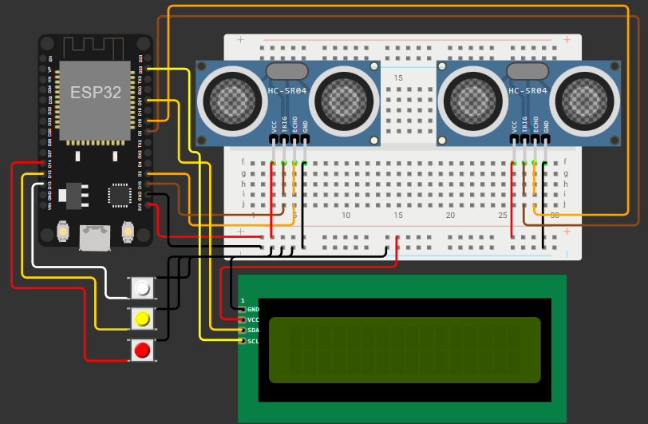

# 🐾 Challenger IoT — CLYVO VET

Sistema IoT inteligente para monitoramento alimentar e de hidratação de pets utilizando ESP32, sensores ultrassônicos, display LCD I2C, API REST em JSON e dashboard web embarcado no próprio ESP32.

---

# 📖 Sobre o Projeto

O **CLYVO VET** foi desenvolvido com o objetivo de auxiliar tutores e profissionais veterinários no acompanhamento do comportamento alimentar e da hidratação de animais domésticos.

O sistema monitora automaticamente quando o pet:
- se aproxima do recipiente de comida
- se aproxima do recipiente de água

Cada evento é registrado em tempo real, armazenando:
- quantidade de visitas
- horário exato do evento
- histórico diário
- tipo da interação

Além disso, os dados são disponibilizados através de:
- API REST em JSON
- dashboard web local
- integração Wi-Fi

---

# 🎯 Objetivo

O projeto busca transformar ações simples do cotidiano em dados relevantes para análise comportamental e prevenção de problemas de saúde.

Muitos tutores:
- não acompanham a rotina do pet
- não percebem alterações de comportamento rapidamente
- não possuem histórico de alimentação e hidratação

O CLYVO VET resolve isso automatizando todo o monitoramento.

---

# 💡 Funcionalidades

✅ Monitoramento de alimentação  
✅ Monitoramento de hidratação  
✅ Registro de horário via NTP  
✅ Histórico diário automático  
✅ Reset automático a cada novo dia  
✅ API REST em JSON  
✅ Dashboard web embarcado no ESP32  
✅ Display LCD em tempo real  
✅ Integração via Wi-Fi  
✅ Botões físicos para visualização dos dados no Serial Monitor  
✅ Sistema embarcado utilizando ESP32  

---

# 🧠 Funcionamento do Sistema

O sistema utiliza dois sensores ultrassônicos HC-SR04:

- um sensor monitora a área da comida
- outro sensor monitora a área da água

Quando o pet aproxima do recipiente:
1. o sensor detecta redução da distância
2. o ESP32 identifica a presença
3. o sistema registra o horário via NTP
4. os contadores do dia são atualizados
5. o LCD exibe o evento
6. os dados ficam disponíveis na API REST
7. o dashboard web é atualizado automaticamente

Quando o relógio atinge **00:00**, o sistema:
- cria automaticamente um novo dia
- reinicia os contadores diários
- mantém o histórico dos dias anteriores

---

# 🌐 Dashboard Web

O projeto possui um dashboard web hospedado diretamente no ESP32.

A interface pode ser acessada através do IP local exibido no LCD.

## Funcionalidades do Dashboard

✅ Visualização em tempo real  
✅ Quantidade de refeições  
✅ Quantidade de hidratações  
✅ Histórico diário  
✅ Atualização automática  
✅ Interface responsiva  
✅ Consumo da API REST local  

---

# 🖼️ Preview do Projeto



---

# 🎥 Vídeo Demonstrativo

Assista à demonstração completa do projeto no YouTube:

🔗 https://youtu.be/ngr6tGGZNsc

---

# 🔧 Tecnologias Utilizadas

## Hardware

- ESP32
- 2x Sensores HC-SR04
- LCD I2C 16x2
- Protoboard
- Botões físicos
- Jumpers

---

## Software

- Arduino C++
- ESP32 WiFi
- WebServer
- HTML/CSS/JavaScript
- NTP
- Wokwi
- LCD I2C

---

# ⚙️ Componentes e Pinos

## Sensores

### Sensor de Comida

| Componente | Pino ESP32 |
|---|---|
| TRIG | GPIO 5 |
| ECHO | GPIO 18 |

---

### Sensor de Água

| Componente | Pino ESP32 |
|---|---|
| TRIG | GPIO 15 |
| ECHO | GPIO 2 |

---

## LCD I2C

| LCD | ESP32 |
|---|---|
| SDA | GPIO 21 |
| SCL | GPIO 22 |
| VCC | 3V3 |
| GND | GND |

---

## Botões

| Botão | Pino |
|---|---|
| STATUS | GPIO 13 |
| ÁGUA | GPIO 12 |
| COMIDA | GPIO 14 |

---

# 🌐 API REST

O ESP32 cria um servidor HTTP local disponibilizando os dados do sistema em formato JSON.

---

# 📡 Endpoint `/status`

Retorna o resumo geral do dia atual.

## Exemplo

```json
{
  "data": "12/03/2026",
  "visitasComida": 5,
  "visitasAgua": 3
}
```

---

# 🍖 Endpoint `/comida`

Retorna:
- quantidade de visitas à comida
- horários registrados

## Exemplo

```json
{
  "data": "12/03/2026",
  "visitasComida": 5,
  "visitaHorario": [
    "08:10:22",
    "12:40:11"
  ]
}
```

---

# 💧 Endpoint `/agua`

Retorna:
- quantidade de visitas à água
- horários registrados

## Exemplo

```json
{
  "data": "12/03/2026",
  "visitasAgua": 3,
  "visitaHorario": [
    "09:14:55",
    "13:02:10"
  ]
}
```

---

# 📚 Endpoint `/historico`

Retorna o histórico geral separado por dias.

## Exemplo

```json
{
  "12/03/2026": {
    "visitasComida": 4,
    "visitasAgua": 2
  },
  "13/03/2026": {
    "visitasComida": 7,
    "visitasAgua": 5
  }
}
```

---

# 🖥️ Interface LCD

O display LCD apresenta informações em tempo real durante toda execução do sistema.

---

## Inicialização

```text
Iniciando...
```

---

## Conexão Wi-Fi

```text
Conectando
WiFi...
```

---

## Wi-Fi conectado

```text
WiFi conectado
```

---

## Exibição do IP

```text
IP:
192.168.x.x
```

---

## Tela principal

```text
Refeicoes: X
Hidratacao: X
```

---

## Evento de alimentação

```text
Pet comeu!
12:40:22
```

---

## Evento de hidratação

```text
Bebeu agua!
13:10:11
```

---

# 🔘 Botões Físicos

O sistema possui três botões físicos conectados ao ESP32.

Cada botão imprime um JSON específico no Serial Monitor.

---

## Botão STATUS — GPIO 13

Exibe:

```json
{
  "data": "12/03/2026",
  "visitasComida": 5,
  "visitasAgua": 3
}
```

---

## Botão ÁGUA — GPIO 12

Exibe:

```json
{
  "data": "12/03/2026",
  "visitasAgua": 3,
  "visitaHorario": [
    "09:14:55",
    "13:02:10"
  ]
}
```

---

## Botão COMIDA — GPIO 14

Exibe:

```json
{
  "data": "12/03/2026",
  "visitasComida": 5,
  "visitaHorario": [
    "08:10:22",
    "12:40:11"
  ]
}
```

---

# 📡 Conectividade

O sistema:
- conecta automaticamente ao Wi-Fi
- sincroniza horário via NTP
- cria um servidor HTTP local
- disponibiliza os dados em JSON
- mantém histórico diário automático
- hospeda um dashboard web local

---

# 🧠 Lógica de Detecção

Os sensores ultrassônicos medem distância continuamente.

O sistema considera presença quando a distância medida for menor que:

```cpp
const int LIMITE = 15;
```

Isso significa:
- pet próximo do recipiente
- evento registrado
- contador incrementado
- horário armazenado

---

# 📅 Sistema de Histórico Diário

O sistema possui controle automático de datas utilizando sincronização NTP.

Quando um novo dia começa:
- os contadores diários são reiniciados
- novos registros passam a pertencer ao novo dia
- o histórico anterior permanece salvo

Isso permite:
- acompanhamento por datas
- análises futuras
- dashboards históricos
- comparação de comportamento

---

# 🤖 Assistente Virtual CLYVO VET — Generative AI

Além do sistema IoT, o projeto conta com um **assistente virtual baseado em Inteligência Artificial Generativa**, desenvolvido para interpretar perguntas do tutor e consultar os dados reais coletados pelo ESP32.

O assistente funciona como uma camada de interação entre o tutor e a API do CLYVO VET, permitindo consultar informações de alimentação e hidratação utilizando linguagem natural.

## 🎯 Objetivo do Assistente

O objetivo é facilitar o acesso aos dados do monitoramento sem exigir que o tutor consulte diretamente os endpoints da API.

Por exemplo, em vez de acessar manualmente `/comida`, o tutor pode perguntar:

```text
"Quantas vezes meu pet comeu hoje?"
```

O assistente interpreta a solicitação, utiliza a ferramenta correspondente, consulta os dados do IoT e apresenta a informação de forma clara.

---

## 🧠 Escopo do Agente

O assistente foi projetado para permanecer dentro do escopo do projeto.

### Consultas permitidas

- quantidade de visitas à comida
- horários das visitas à comida
- quantidade de visitas à água
- horários das visitas à água
- primeiro evento registrado
- último evento registrado
- resumo diário
- consulta do histórico
- consultas relacionadas a datas específicas

### Fora do escopo

O agente não deve:

- responder perguntas aleatórias sem relação com o CLYVO VET
- auxiliar em programação ou desenvolvimento de código
- gerar imagens
- responder assuntos não relacionados ao monitoramento
- inventar dados que não foram retornados pelo IoT
- realizar diagnósticos médicos

A Inteligência Artificial atua como **assistente de interpretação dos dados**, não como substituta de um profissional veterinário.

---

## 🔧 Tools do Assistente

Para conectar a IA aos dados do CLYVO VET, foram definidas ferramentas específicas:

```python
tools_list = [
    consultar_status,
    consultar_comida,
    consultar_agua,
    consultar_historico
]
```

### `consultar_status()`

Consulta o resumo do dia atual:

```json
{
  "data": "13/03/2026",
  "visitasComida": 4,
  "visitasAgua": 2
}
```

### `consultar_comida(data)`

Consulta os registros relacionados à alimentação:

```json
{
  "data": "13/03/2026",
  "visitasComida": 4,
  "visitaHorario": [
    "08:15:32",
    "12:04:18",
    "15:37:41",
    "19:10:05"
  ]
}
```

### `consultar_agua(data)`

Consulta os registros relacionados à hidratação:

```json
{
  "data": "13/03/2026",
  "visitasAgua": 2,
  "visitaHorario": [
    "09:42:10",
    "16:25:33"
  ]
}
```

### `consultar_historico()`

Consulta os registros armazenados de diferentes dias:

```json
{
  "12/03/2026": {
    "visitasComida": 4,
    "visitasAgua": 2
  },
  "13/03/2026": {
    "visitasComida": 7,
    "visitasAgua": 5
  }
}
```

---

## 🔄 Fluxo da Inteligência Artificial

O funcionamento do assistente segue o fluxo:

```text
Tutor
  │
  ▼
Pergunta em linguagem natural
  │
  ▼
Assistente CLYVO VET
  │
  ▼
Interpretação da intenção
  │
  ├── Alimentação ──────► consultar_comida()
  │
  ├── Hidratação ───────► consultar_agua()
  │
  ├── Status ────────────► consultar_status()
  │
  └── Histórico ─────────► consultar_historico()
                              │
                              ▼
                         API / IoT
                              │
                              ▼
                            JSON
                              │
                              ▼
                    Assistente CLYVO VET
                              │
                              ▼
                       Resposta ao tutor
```

Dessa forma, a IA não precisa armazenar ou inventar os eventos. Ela utiliza os dados fornecidos pelo sistema IoT para construir a resposta.

---

## 📋 Saída Estruturada com Pydantic

O projeto também utiliza **Pydantic** para transformar a consulta realizada pelo assistente em uma estrutura de dados validada.

A estrutura `FichaMonitoramento` representa uma consulta ao sistema:

```python
from typing import Literal, Optional
from pydantic import BaseModel


class FichaMonitoramento(BaseModel):

    nome_pet: str

    tipo_consulta: Literal[
        "status",
        "comida",
        "agua",
        "historico"
    ]

    data: Optional[str] = None

    informacao_solicitada: Literal[
        "quantidade",
        "horarios",
        "ultimo_evento",
        "primeiro_evento",
        "resumo"
    ]

    visitas_comida: Optional[int] = None

    visitas_agua: Optional[int] = None

    horarios_comida: Optional[list[str]] = None

    horarios_agua: Optional[list[str]] = None

    resposta: str
```

### Exemplo de consulta

Pergunta do tutor:

```text
"Quantas vezes o Thor comeu hoje?"
```

Dados estruturados:

```json
{
  "nome_pet": "Thor",
  "tipo_consulta": "comida",
  "data": "13/03/2026",
  "informacao_solicitada": "quantidade",
  "visitas_comida": 4,
  "visitas_agua": null,
  "horarios_comida": null,
  "horarios_agua": null,
  "resposta": "Hoje o Thor foi até o comedouro 4 vezes."
}
```

A estrutura permite validar os dados recebidos e manter uma saída padronizada para futuras integrações com o sistema.

---

## 💬 Interação com o Assistente

O sistema possui um chat em terminal para interação com o CLYVO VET.

Exemplo:

```text
--- Assistente CLYVO VET iniciado ---
Você: Quantas vezes meu pet comeu hoje?

CLYVO VET: Hoje foram registradas 4 visitas à comida.

Você: Que horas ele bebeu água?

CLYVO VET: Hoje foram registradas 2 visitas à água,
às 09:42:10 e 16:25:33.
```

O chat utiliza o modelo configurado e disponibiliza as ferramentas do sistema através de:

```python
chat = client.chats.create(
    model=MODEL_NAME,
    config={
        "system_instruction": SYSTEM_PROMPT,
        "tools": tools_list
    }
)
```

---

## 🛡️ Confiabilidade dos Dados

Um dos princípios do assistente é utilizar somente informações disponíveis no sistema.

```text
Dado não disponível
       ↓
Não inventar
       ↓
Informar que não há dados suficientes
```

Isso evita que a IA apresente como fato uma informação que não foi registrada pelos sensores ou retornada pela API.

---

## 🚀 Arquitetura Atualizada

Com a inclusão da Generative AI, a arquitetura do CLYVO VET passa a integrar:

```text
┌───────────────┐
│      Pet      │
└───────┬───────┘
        │
        ▼
┌───────────────────┐
│ Sensores HC-SR04  │
└─────────┬─────────┘
          │
          ▼
┌───────────────────┐
│       ESP32       │
│ Monitoramento IoT │
└─────────┬─────────┘
          │
          ▼
┌───────────────────┐
│    API REST       │
│       JSON        │
└─────────┬─────────┘
          │
          ├──────────────► Dashboard Web
          │
          ▼
┌───────────────────┐
│   CLYVO VET AI    │
│ Generative AI     │
└─────────┬─────────┘
          │
          ▼
┌───────────────────┐
│   Tutor / Usuário │
└───────────────────┘
```

A integração representa a evolução do projeto de um sistema de monitoramento IoT para uma solução que combina **IoT + API + Generative AI + dados estruturados**, mantendo o foco no acompanhamento da alimentação e hidratação dos pets.

---

# 🧪 Simulação no Wokwi

🔗 https://wokwi.com/projects/463362553076345857

---

# 🧪 Simulação no Colab

🔗 https://colab.research.google.com/drive/1uQOtW1o4nlOGtkVi7hAWlylnQ0dQWuv4

---

# 💻 Repositório GitHub

🔗 https://github.com/ZeDio/Challenger_IOT

---

# 👨‍💻 Equipe

Projeto desenvolvido por:

- José Diogo - ZeDio
🔗 https://github.com/ZeDio

- Arthur Dos Santos - Arth.pv
🔗 https://github.com/ArthurCPV

- Mariana Xavier - Marixavq
🔗 https://github.com/Marixavq

- Júlia Tiziotto - JúliaB
🔗 https://github.com/JuliaTButtler

- Bruno Martins - Taikawaititi
🔗 https://github.com/Taikawaititi

---

# 📚 Projeto Acadêmico

Projeto desenvolvido para a disciplina:

**Disruptive Architectures: IoT, IoB & Generative AI**

---